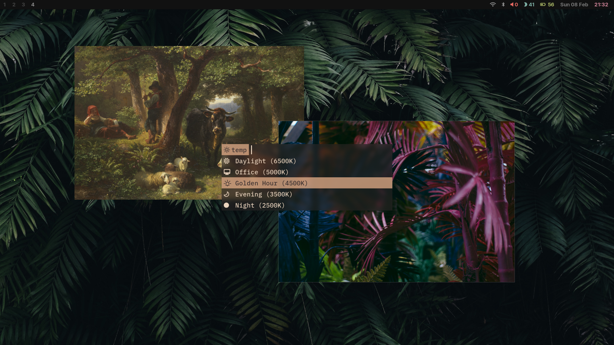

### 🧿 dots

dotfiles for my daily driver. i run arch with hyprland as my wm.
config currently includes:
- foot (terminal)
- zsh (shell)
- neovim (editor)
- yazi (file manager)
- waybar (status bar)
- & more

&nbsp;

#### Gallery

#### Notes

this config uses a number of shell scripts, which may be found [🐚 here](https://github.com/mellowcoffee/scripts)
