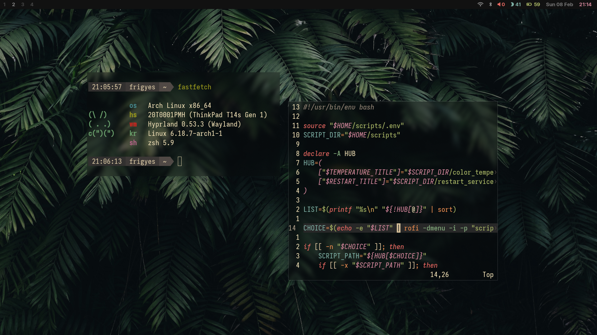
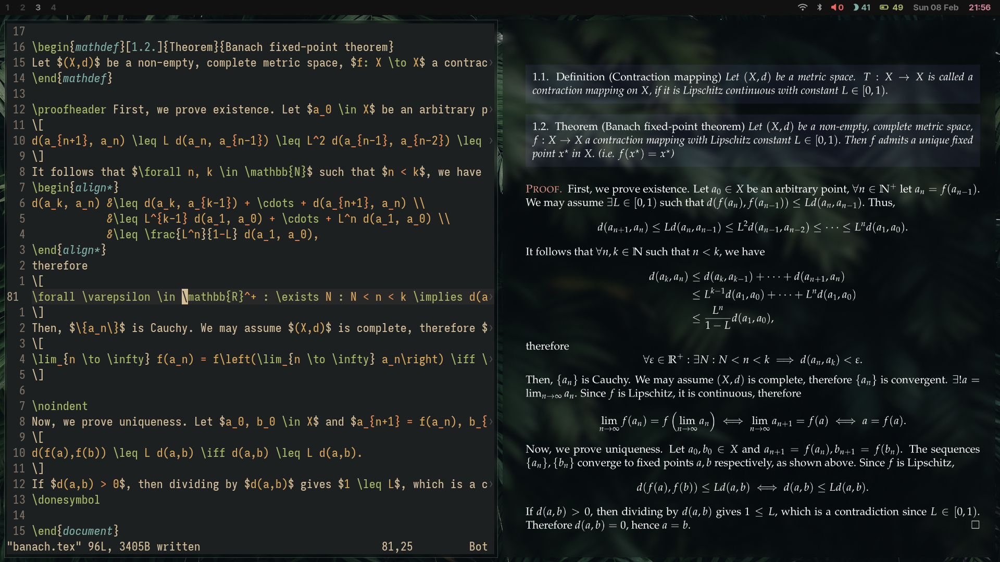
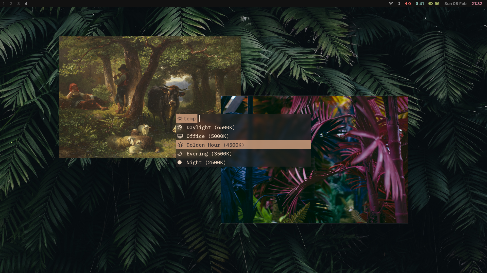

## 🧿 dots



dotfiles for my daily driver. i run arch with hyprland as my wm.
config currently includes:
- hyprland (wm)
- foot (terminal)
- zsh (shell)
- neovim (editor)
- yazi (file manager)
- waybar (status bar)
- rofi (picker)
- & more


### gallery



### installation

```bash
git clone https://github.com/mellowcoffee/dots.git
cd dots
```

a script is provided to install the configs. any existing config is backed up, and the present dotfiles are symlinked.

```bash
./install.sh nvim dunst fastfetch # install individual configs by directory name
./install.sh -a # install all configs
```

config files that aren't provided in a directory, such as `.vimrc` and `.bashrc` may be linked to manually.

```bash
ln -s ./.vimrc ~/.vimrc
ln -s ./.bashrc ~/.bashrc
```

### notes

this config uses a number of shell scripts, which may be found [🐚 here](https://github.com/mellowcoffee/scripts)
